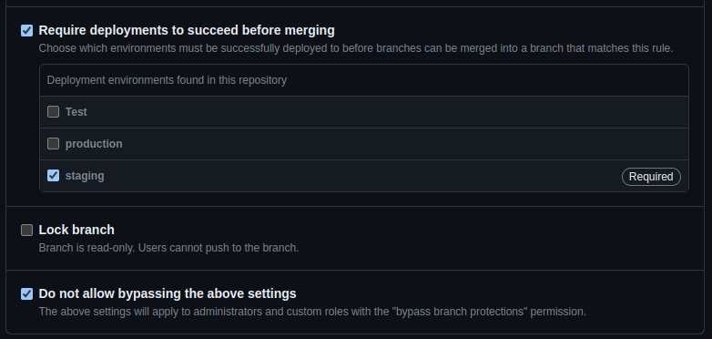

# GUIDE D’UTILISATION DU CICD DU PROJET LMS (GITHUB ACTIONS)

## Préambule

L’objectif de ce guide est de montrer le **fonctionnement** du système d’intégration, de livraison et de déploiement continu du projet **Learning Management System** de **Digital Network Transformation.**

En particulier, il mettra en évidence les **moyens** dont disposent les **développeurs** pour:
- **tester** le code
- gérer les **tags**
- **livrer** et **déployer** le code
- gérer le projet de façon **agile**

Son objectif n’est pas de montrer le fonctionnement de GitHub Actions.

Enfin, comme les deux applications du projet (front et back) sont développées sous node, nous utilisons la même structure de pipeline pour les deux dépôts.

Des bases sur Git et GitHub sont nécessaires à la bonne compréhension de ce guide.

## CI/CD

### Protection de la branche main
La branche main est protégée, n’acceptant seulement des commits validant le status check “tests”.

Le status check “tests” correspond à l’exécution et validation du job “tests” présent dans le workflow **📁 .github/workflows/ci.yml**

### Automatisation

#### pre-commit

A **chaque commit**, le système vérifie que le code respecte les règles **eslint**, qu’il **build** correctement et qu’il passe les **tests unitaires**. L’objectif de ces tests est de repérer aussi tôt que possible toute éventuelle régression.

💡 Si l’une des 3 vérifications échoue, le commit échoue.
Vous pouvez utiliser le flag  **--no-verify**  pour commit de force (sans crainte, le code sera testé de nouveau par la suite).

#### branche develop

Systématiquement, lorsque du code est poussé sur la branche develop le workflow **📁 .github/workflows/ci.yml** est exécuté automatiquement. Celui-ci joue les tests unitaires et d’intégration, après avoir build l’application dans un container Docker.

La réussite des tests à ce niveau là n’est pas bloquante pour le push, mais vise plutôt à donner une idée approximative aux développeurs de la qualité de leur code et de les inciter à écrire les tests au fur et à mesure du développement.

💡 Néanmoins, si ces tests ne **passent pas**, il sera **impossible de pousser** ce code sur la branche **main**.

#### branche main

Il est possible de pousser du code directement sur la branche main à condition que le commit en question ait passé les tests du workflow **📁 .github/workflows/ci.yml**.

La manière la plus simple, et recommandée, de mettre à jour la branche **main** est de toujours commencer par pousser son code sur la branche **develop**, puis, en fonction des préférences, au choix:
Effectuer une PR sur la branche **main** depuis la branche **develop** fraîchement poussée
Pousser de nouveau le code, mais cette fois-ci directement sur la branche main

Une fois le code poussé sur la branche main le workflow **📁 .github/workflows/cicd.yml** est exécuté automatiquement. Celui-ci lance 3 jobs en série:

- les **tests** unitaires et d’intégration, cette fois-ci **bloquants**

- si réussite des tests précédents, le code est scanné par **SonarCloud** et **Snyk** afin de vérifier qu’il respecte la qualité de code minimum exigée (**par défaut bloquant également**) et qu’il ne présente pas de vulnérabilités
Un rapport est automatiquement disponible sur les portails de SonarCloud et Snyk.

- (optionnel) **À condition** que la **décision de livrer et déployer** ait été prise, **et que les deux jobs précédents soient validés**, le dernier job s’exécute et:
  - met à jour la version de l’application
  - crée la GitHub Release correspondante
  - met à jour l’image disponible sur Docker Hub
  - déploie l’application dans le cloud

💡 Bien que non nécessaires puisque déjà joués précédemment, ici, les tests unitaires et d’intégration assurent qu’aucun code défaillant ne puisse être livré ou déployé.

#### Mise à jour de version, livraison et déploiement

La livraison et le déploiement, ainsi que la mise à jour de la version (git tag) sont assurés par le dernier job exécuté par **📁 .github/workflows/cicd.yml**

Contrairement aux autres jobs du workflow **📁 .github/workflows/cicd.yml**, celui-ci demande une action manuelle de la part des développeurs pour pouvoir s’exécuter.

Pour déclencher ce job, il suffit d’insérer la string **\*\*RELEASE\*\*** dans le commentaire du commit poussé sur la branche main.

Celui-ci va:
1. **Mettre à jour le numéro de version (semVer)** en créant un nouveau git tag à partir du dernier.
    - **Par défaut**, le numéro de version est augmente de **+0.0.1** (correctif)

    - **Pour l’augmenter d’une version mineure**, il faut ajouter la string **"feat([domaine-de-la-modification])"** au début du message du commit, suivi entre parenthèses du nom de la fonctionnalité.

          feat(auth)

    - **Pour l’augmenter d’une version majeure**, il faut ajouter la string **"perf([domaine-de-la-modification])"** au début du message du commit, suivi entre parenthèses du nom de la fonctionnalité

          perf(2 factor auth)

2. **Créer la GitHub Release** correspondant au dernier tag créé par le job précédent.
3. **Mettre à jour l’image Docker** de l’application dans Docker Hub
4. **Déployer** l’application dans le cloud

💡 Il est possible d’importer et d’exécuter un workflow dans un autre workflow.

### Environnements

Chaque job est assigné à un environnement créé au préalable sur la page GitHub du dépôt.

Cela permet de:
- s’assurer qu’on ne joue que les jobs que l’on souhaite pour la situation donnée (e.g. seule la branche **main** peut aller en production).
- de passer des secrets et variables d’environnement à l’application, en fonction de l’environnement, si nécessaire. (e.g. identifiants/mots de passe)

Il existe deux environnements pour le dépôt:
- **Staging**, là où les tests et scans sont exécutés (**main** et **develop** peuvent y être déployées)
- **Production**, là où les procédures de déploiement sont exécutées (seule **main** peut y être déployée)

## Recommandations

Il est vivement recommandé d’utiliser a minima un **outil de suivi de tickets**. 
L’outil **GitHub Issues** remplit ce rôle et présente l’avantage d’être intégré à GitHub.

Il est également recommandé d’utiliser des outils graphiques facilitant la **gestion de projet** tels qu’un **spreadsheet**, un **task-board** ou encore une **road map**.
L’outil **GitHub Projects** remplit ce rôle, et s’intègre également dans tout l’écosystème de GitHub, notamment les Issues et les Pull request, permettant un suivi précis de l’avancée du projet.

## Ressources annexes

liens vers les comptes Docker Hub / SonarCloud / Snyk

lien vers la production (?) et vers le serveur bêta (?)

